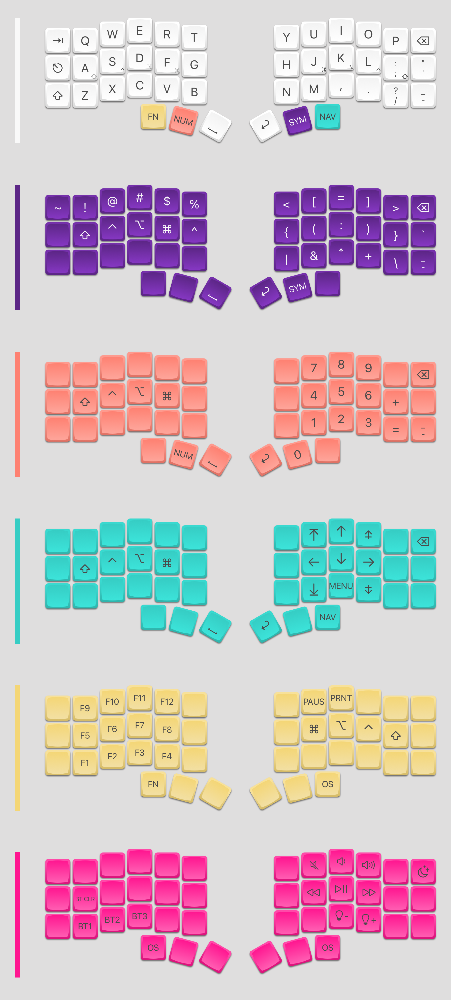

# Corne-ish Zen

## Keymap

See [`config/corne-ish_zen.keymap`](config/corne-ish_zen.keymap)

### Notes

- TODO - explain why the keymaps is this way

## Updating the keyboard

- Building

  - Push a change to main branch
  - GitHub action will run; download from the "Merged Artifacts" step

- Flashing each side:
  - Connect with a USB-A-to-USB-C cable; sometimes won't work over USB-C
  - Double-tap the reset button to enter boot loader
  - Drag the .uh2 file onto the Corneish drive
  - It will disconnect when flashed

## Other notes

- Only need the left keymap to be flashed (to the left hand side)

## Troubleshooting Bluetooth connection

> If you are having issue with a lost Bluetooth connection or keyboard halves no longer communicating, and you have tried deleting host connections and re-establishing connections without avail, please try following the steps below to fix this.
>
> - Delete all the Corne-ish Zen connections on your host devices (PC, phone, tablet etc.)
> - Flash the [settings reset firmware](https://cdn.shopify.com/s/files/1/0523/0847/6068/files/Corne-ish_Zen_settings_reset_firmware.zip?v=1684845614) to both halves of the keyboard. Use the same ".uf2" file on both halves. Ignore the .hex file.
> - Flash your custom (or stock) firmware to the left half. After it has been flashed and restarted, disconnect the USB cable and turn off this half.
> - Flash your custom (or stock) firmware to the right half. After it has been flashed and restarted, disconnect the USB cable.
> - Turn on the left half again and ensure that the "X" symbol on the right half display turns to a checkmark instead.
> - Re-establish connections to your host devices.

From [Corne-ish Zen Support](https://lowprokb.ca/pages/corne-ish-zen-support)

## Resources

- [The Corne-ish Zen source repo](https://github.com/LOWPROKB/zmk-config-Corne-ish-Zen)

## Credits

- [rstacruz/my-zmk-config](https://github.com/rstacruz/my-zmk-config)
